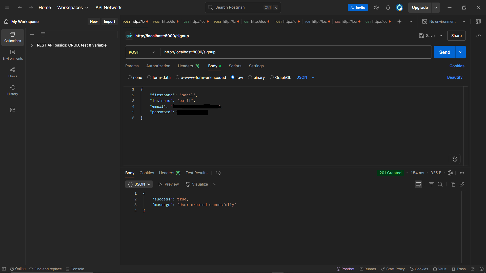
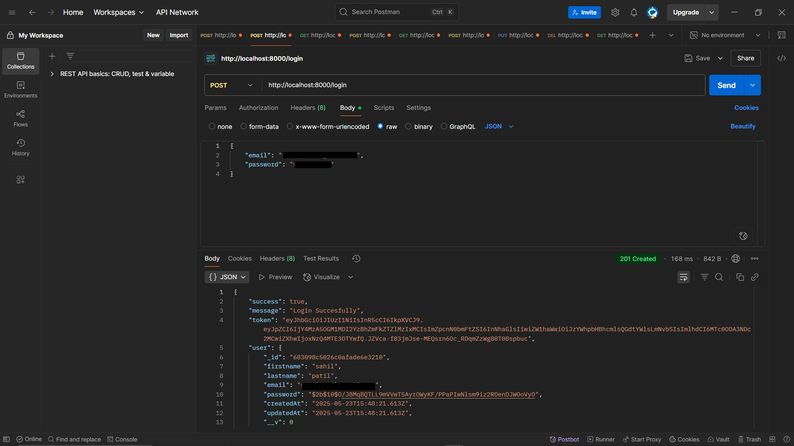
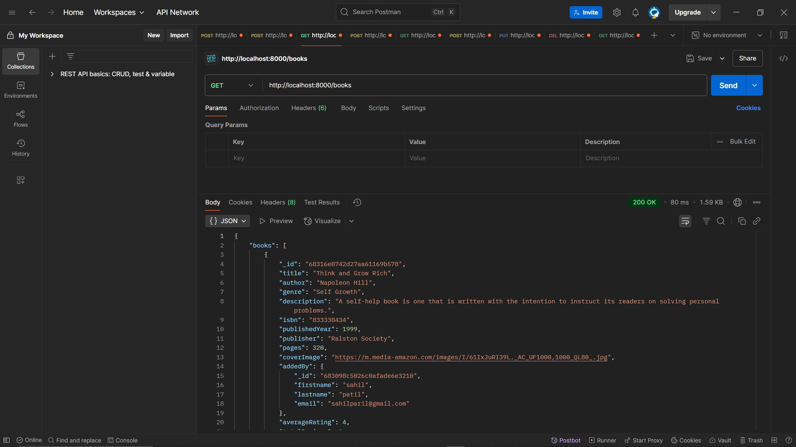
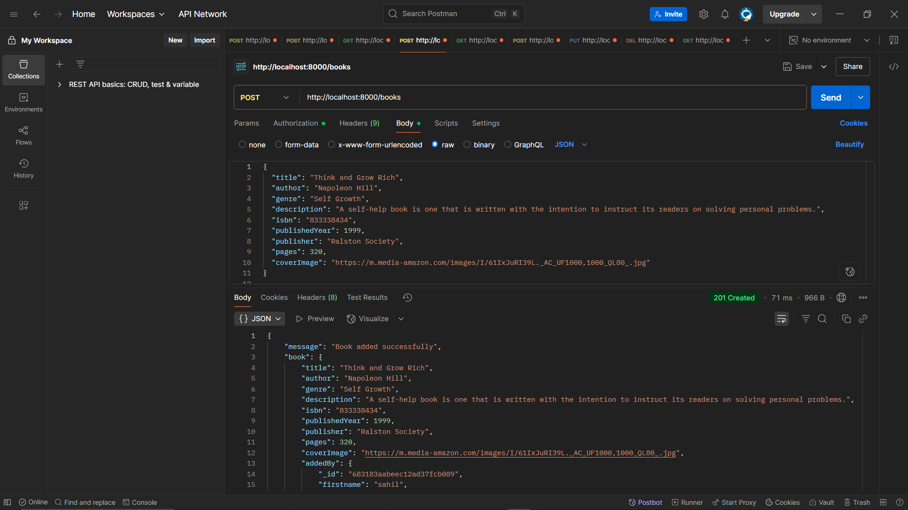
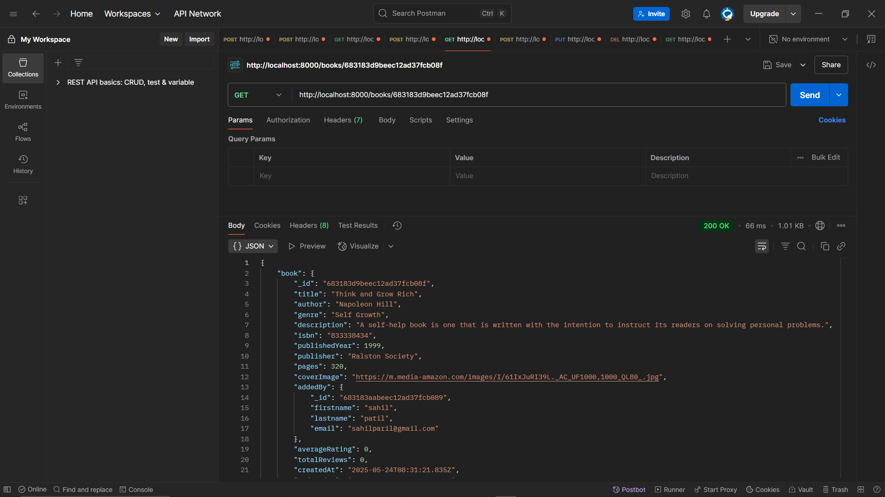
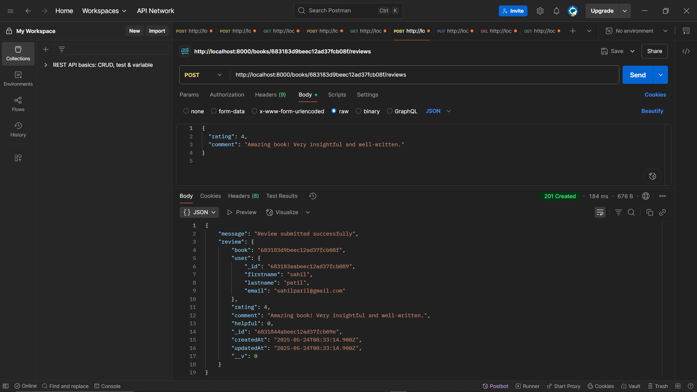
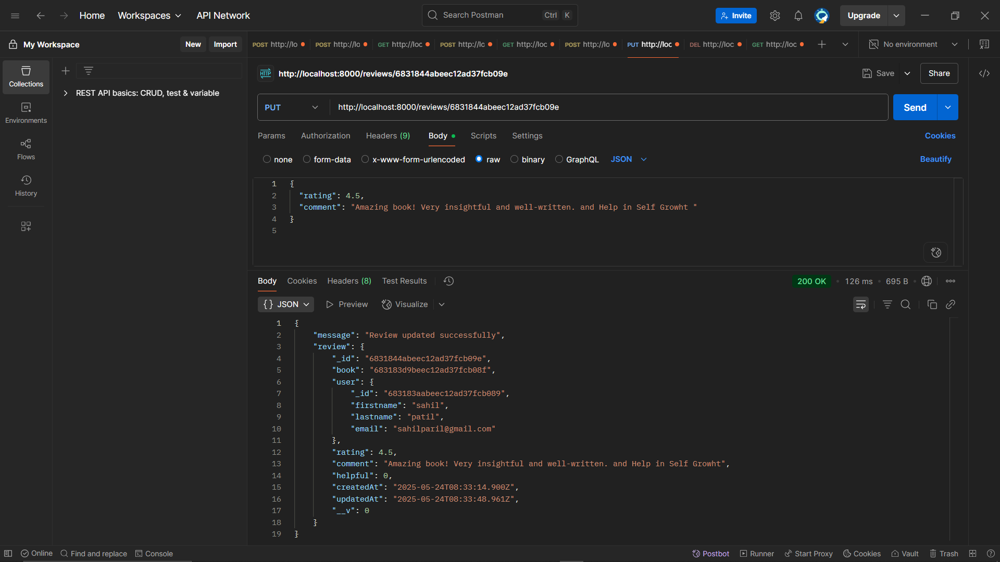
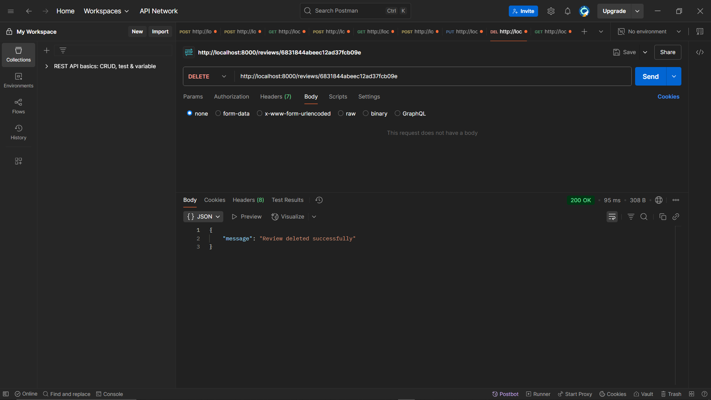
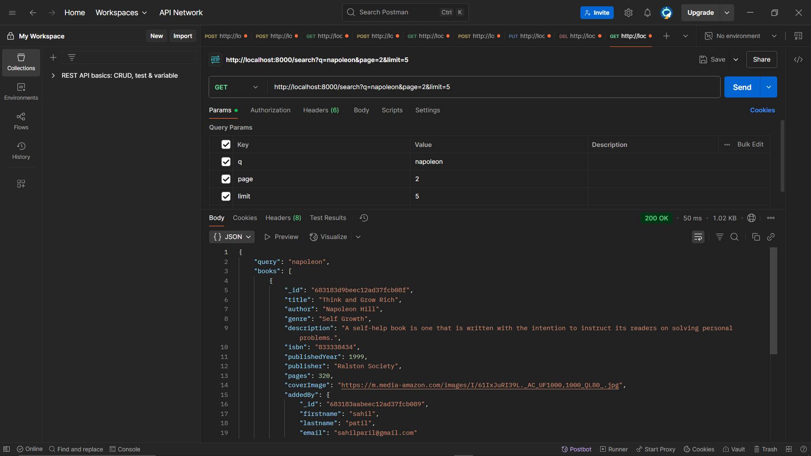

# 📚 Book Review API

A simple and secure RESTful API for a Book Review system built using **Node.js**, **Express.js**, **MongoDB** and **JWT Authentication**. Users can register, login, browse books, leave reviews, and search through a growing book collection.

## 🚀 Features
- User Signup/Login with **JWT-based Authentication**
- Add, Browse, and Search Books
- Leave **One Review per Book** per user
- **Update/Delete** your own reviews
- **Pagination & Filtering** on books and reviews
- Search by **Title or Author**


## 🛠️ Tech Stack
- **Backend:** Node.js, Express.js
- **Database:** MongoDB 
- **Authentication:** JSON Web Tokens (JWT)
- **Environment Variables:** `.env` file for configs

## 📦 Project Setup
#### 1. Clone the Repository
```bash
git clone https://github.com/sahilpatil-009/book-review-api.git
```
#### 2.Enter into directory
```bash
cd /book-review-api
```
#### 3.Install Dependencies
```bash 
npm install
```
#### 4.Create a .env File
```bash
PORT=8000
MONGO_URL=your_mongodb_connection_string
SECRET_KEY=your_jwt_secret_key
```
#### 5. Start the Server
```bash
node index.js
```
#### Server will start on http://localhost:8000


# 🧪 Example API Requests

### 🔐 Authentication

#### Register New User
```bash
curl -X POST "http://localhost:8000/signup" \
  -H "Content-Type: application/json" \
  -d '{
    "firstname": "firstname",
    "lastname": "lastname",
    "email": "email@example.com",
    "password": "mypassword"
  }'
```
#### Login User
```bash
curl -X POST "http://localhost:8000/login" \
  -H "Content-Type: application/json" \
  -d '{
    "email": "email@example.com",
    "password": "mypassword"
  }'
```
### 📚 Books
#### Add Book (Requires Authentication Token)
```bash
curl -X POST "http://localhost:8000/books" \
  -H "Authorization: Bearer <JWT_token>" \
  -H "Content-Type: application/json" \
  -d '{
    "title": "Think and Grow Rich",
    "author": "Napoleon Hill",
    "genre": "Self Growth"
  }'
```

#### Get All Books (Pagination + Filters)
```bash
curl "http://localhost:8000/books?page=1&limit=10&author=Napoleon&genre=SelfGrowth"
```

#### Get Book by ID (with Avg Rating + Reviews)
```bash
curl "http://localhost:8000/books/<book_id>"
```

### ✍️ Reviews

#### Add Review (Requires Authentication Token)
```bash
curl -X POST "http://localhost:8000/books/<book_id>/reviews" \
  -H "Authorization: Bearer <JWT_token>" \
  -H "Content-Type: application/json" \
  -d '{
    "rating": 5,
    "comment": "Fantastic read!"
  }'
```

#### Update Review (Requires Authentication Token)
```bash
curl -X PUT "http://localhost:8000/reviews/<review_id>" \
  -H "Authorization: Bearer <JWT_token>" \
  -H "Content-Type: application/json" \
  -d '{
    "rating": 4,
    "comment": "Changed my mind, still great."
  }'
```
#### Delete Review (Requires Authentication Token)
```bash
curl -X "DELETE http://localhost:8000/reviews/<review_id>" \
  -H "Authorization: Bearer <JWT_token>"
```
#### 🔍 Search Books

```bash
curl "http://localhost:8000/search?q=napoleon"
```

## 📌 Design Decisions & Assumptions
- JWT tokens are used for stateless authentication.
- A user can submit only one review per book.
- Pagination is used for large lists (books & reviews).
- Search is case-insensitive and supports partial matches.
- Error handling includes clear messages and HTTP status codes.

## Example Postman Request Screenshots

### 🔐 Authentication Example




### 📚 Books

#### Get All Books



#### Add Books


#### Get Book Details


#### Add Review of Book


#### Edit Book Review


#### Delete Book Review


#### Search Book
